# 美国超市就能买到枪？比买菜更简单！

> 来源：https://www.bilibili.com/video/BV1AYwQzzEbV
> 生成时间：2026-03-18 00:14

---
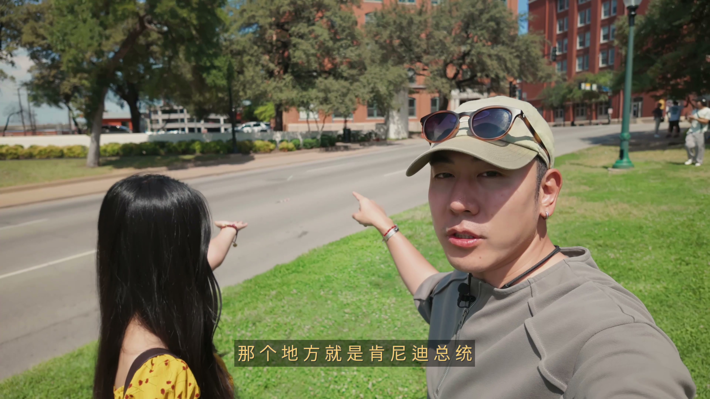

大家看到地上那个叉子了吗 那个地方就是肯尼迪总统 当时被刺杀的地方

---

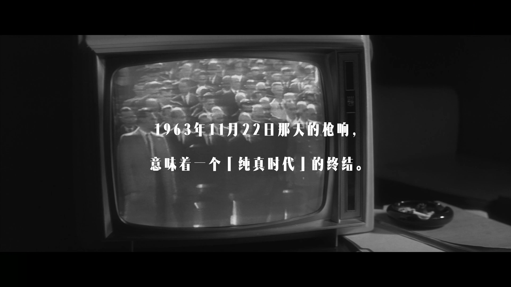

1963年11月22号的那声枪响 意味着一个纯真时代的终结

---

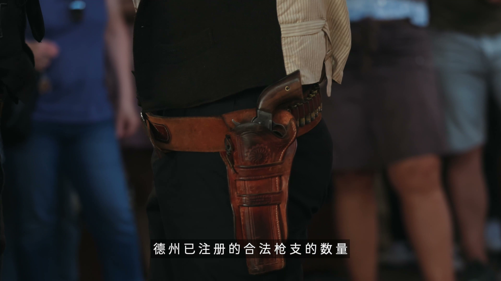

但为什么偏偏发生在这里呢 德克萨斯也许就是那个答案 它有许多鲜明的标签 比如西部牛仔 德州普克 孤星共和国 又譬如民风彪悍 武德充沛 还有扒鸡 哦这个不是 sorry 如果我想买一枪 我需要什么 只需要一枪 给我的粉丝们带一些 吃蛋夹就跟买菜似的 就像你Later 周末这个地方买枪是要排队的 作为美国枪支管理 最为宽松的地区之一 德州允许在公共场合携带枪支 德州已注册的合法枪支的数量 就足以匹敌一些国家的武装力量 每个萨拉斯人家里都有枪 基本上算是吧 那这里也是牛仔文化的发源地 也是全美最保守的地区 然后在这真的你买一把枪 就像买菜一样简单 虽然我们因为是中国公民 不能在这合法的持枪 但是 但是我们有浩瀚MTC Pro 这合唱不是另外一种武器呢 所以这次我们在德州旅行 将全程使用这台北名气来拍摄 我们的德州大冒险 就从萨拉斯开始吧

---

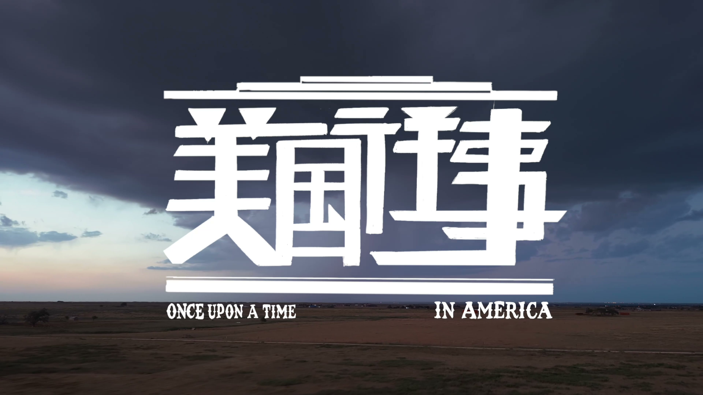

欢迎收看美国网事第三集 萨拉斯

---

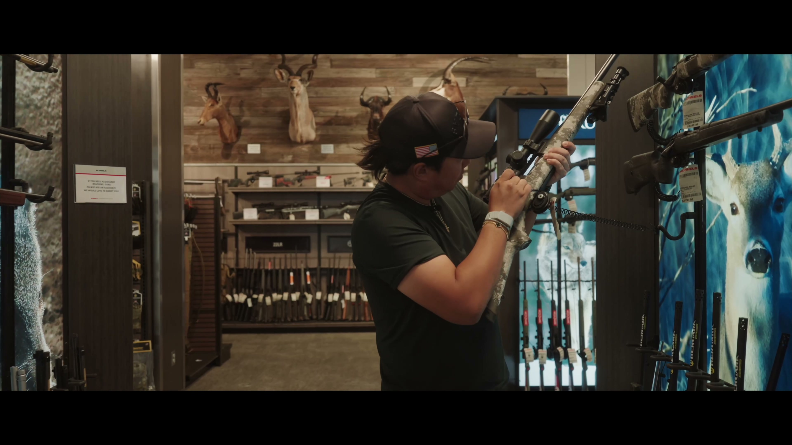

我靠 没事 这都是 我还是会害怕

---

这是我的高中同学 也是在同一个乐团 奋斗过三年的老姜 当然高中毕业以后 他就来了美国 今天也是他在 萨拉斯这座城市的第15个年头 上次我们见面还是10年前 我跟我老朋友10年没见 哇 你瞧这个 这小鸡肉 哇 他怎么吃的有点好的 有点头发烦了 我们在这个别墅区里面 看了20分钟 还是这个别墅 人的心里就是 马云可以过得好 但我 现在是在吃的 马云可以过得好 但我 兄弟 但我发小不行 王子说

---

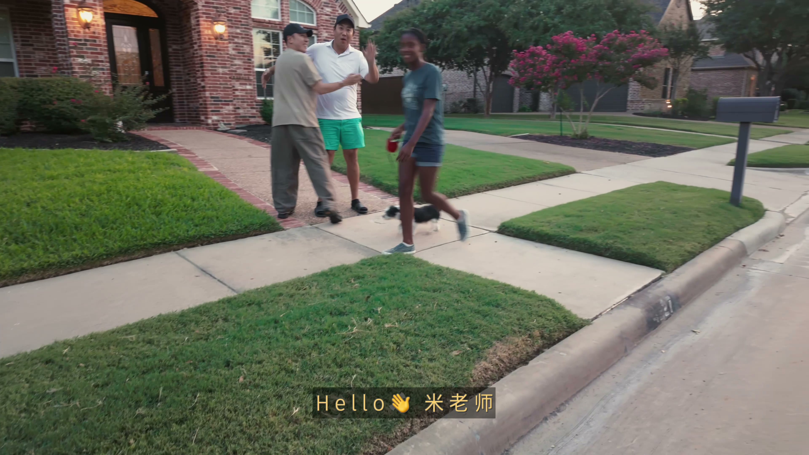

萨拉斯好久不见 你好 你好 你老师 你好 我们好

---

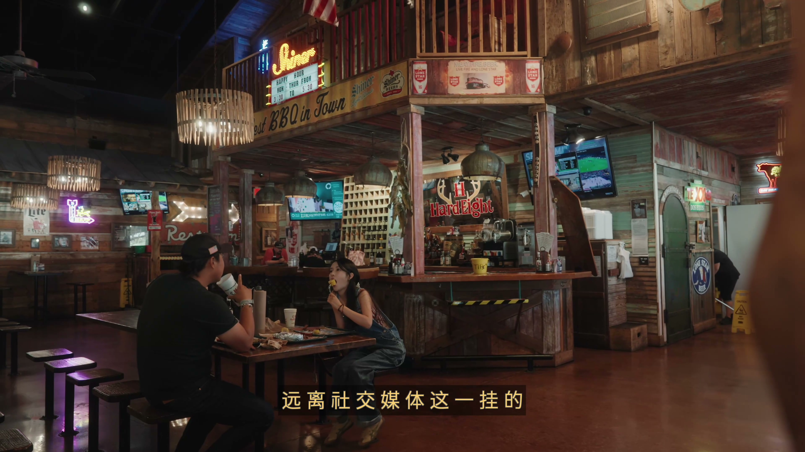

我们分别的时候是18岁 当中间见了几个 15到18岁的时候 我们几乎是天天在一起 不对 因为要排练 这边18年 那边18年 有什么食物是你没法割舍的吗 食物 豆汁 豆汁还好 因为炒蛋 炒肝好吃 生意北京孩子 要脸 老江不知道 我刚给他科普的 那你知道 坦克是没有后视镜的吗 不知道 这是什么肝 B站还看 B站会看你们俩 其他人不看 这不是说捧根 我是属于 远离社交媒体这一挂的 对 比较喜欢户外玩枪 哇 哥 怎么这么快 这是我的小玩具 哇塞 拿枪的时候还是要 不管是什么时候 出于安全考虑 你要看一下这个里面有没有子弹 每一次都是这样 因为我们两个能相信一个人 这个动作叫Clear一把枪 对 这挺帅的 什么我们叫枪 其实是这个下面叫Lower Lower 对 这叫Upper 那这些呢 这些都是吹箭 打兔子 打猎子 你们狩猎也需要狩猎证吗 对 去温哥马买个证就行 20块钱 几十块钱

---

这是一个体育用品商店 在达拉斯买一把枪有多容易呢 起初我们只是随便来一个超市 为了买点吃的买一双鞋 结果一上楼 哇靠 就这么办 对 像不像超级市场 所有的配件 镜子 瞄准器 红点 所有都有 这弹夹就跟买菜似的 全给勒着了 然后十九块钱一个 我刚买完步枪的时候 我就来一口然后走了 也不数 根本就不数 镜头盖 镜头盖 永远不嫌多 说话朋友 这个真的很震撼 一条龙幅 一条龙幅 一条龙幅 一条龙幅 一条龙幅 一条龙幅 你今天就走不了了这块 你看看这刀多少钱 看看 500刀 那边一把手枪250

---

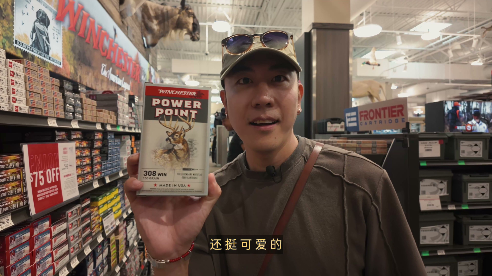

这感觉很复古 这个蛮好看的 仿古枪 还是它就是真古的古枪 真古枪 1953年 它会保值吗 这种老枪 只有老枪可以 现在量产的枪都不能保值 全是一买就点 和我们跟相机一样 所有口径 所有大小 所有的规格 所有的材质 打猎的 不打猎的 玩的 太多牌子了 这是打我用的 麻吉可爱的 这都是鹿 一颗多少钱 一颗两块 14块钱 14块就可以让你命 对 这是真实的 这个地儿它对鹿太不友好了 这个说实话有点 突然间跟鹿共情了 感觉挺适应的 我鹿眼对焦 好 周末这个地方 买枪是要排队的 因为人太多了 我现在看到枪刀 不是枪的感觉了 是什么 菜刀

---

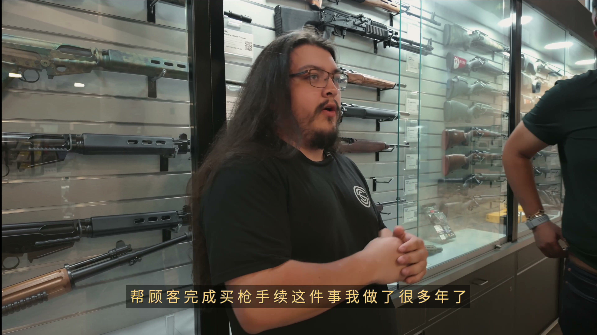

这么快

---

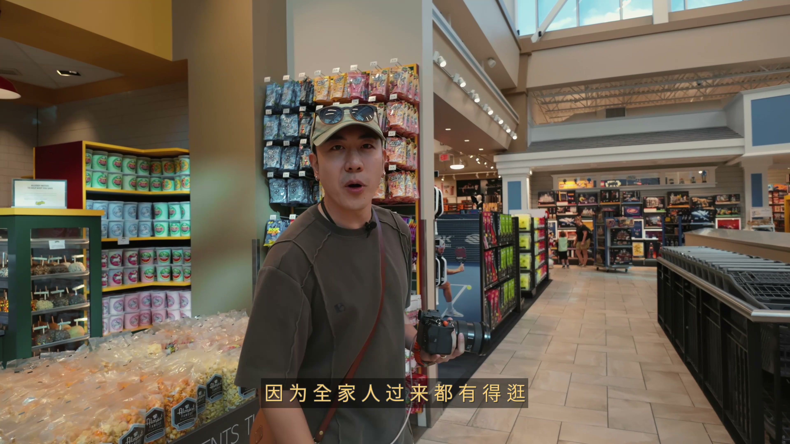

虽然我和米老师 没有德州驾照 买不了枪 但我们可以买这些 你能买枪吗 我可以 对 枪你可以 我朋友们 我可以买子弹 他们不管我 我没钱我买子弹干嘛 我扔你 摔炮 摔不了 这玩意儿 这奴工 这个杀伤力也就非常 杀伤力也非常屌的 你18岁的时候 你买了一台车吧 18岁 18岁 如果你是国际上的 我确定 你确定 太癫了 德州太癫了 看到吗 这边是枪 这边是猪狗奴 这边是保险柜 看那边 那边卖乐糕的 还有糖果屋 我真觉得很好 因为全家人过来都有做 买枪这么方便 是不是只有在德州 只有德州 枪支的泛滥与德州的历史 息息相关 在德州早期开发的时候 移民就已经和当地的原住民 产生了暴力冲突 武装自卫在那个时候 就成为了传统 在后续的独立战争中 德州居民更加坚定了 用武力捍卫权力的理念 邪与火的过往 让德州人从骨子里 就产生了对力量的崇拜 德州对于枪支的宽容度 也源自于此 每个达拉斯人的家里都有枪吗 基本上算是吧 但其实德州反而 安全 是最安全 极其安全 因为你不知道 基本上所有人都有枪

---

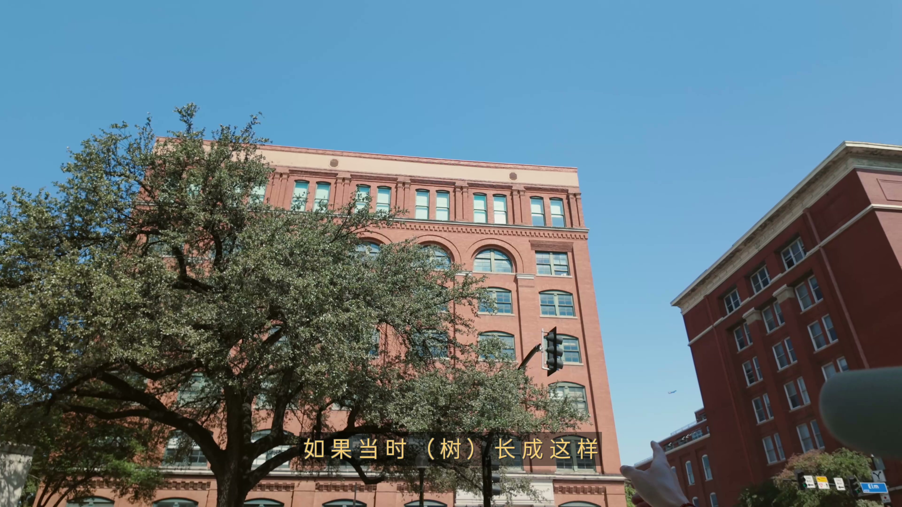

大家看到地上那个叉子了吗 那个地方就是肯尼迪总统 当时被刺杀的地方 也是改变了当时世界格局的 两颗子弹的位置 而当时的凶手 就在我们身后的 这栋建筑的六楼 那个就是当时枪伸出来的位置 然后刚刚我站在那个叉子上 真的有种站在历史上的感觉 我看到了 我看到了 我看到了 我看到了 我看到了 我看到了 我看到了 我看到了 我看到了 我看到了 有种站在历史上的感觉 没有改变过 在这61年代 这个楼上的 这些树在以前会安分多 如果当时长成这样 也许就达不到 枪手射击的位置 如今已经被改造成了 第六层博物馆的景点 61年过去了 肯尼迪的案件依然疑点重重 但不曾改变的是 依然有很多人 来这里缅怀肯尼迪 也可以说他们怀念的是 那个美国工业高速发展 黄金般的年代 然后就那个狙击点 然后从那打的第一枪 第二枪第三枪应该是这个东西 这是当时现场直播拍到的这些 不同机位所用到的 照片和摄影机 这几事件甚至还改变了 全美人民看新闻的习惯

---

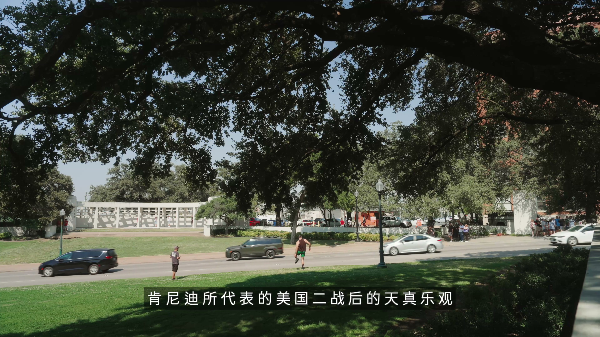

要找出什么情况 有些人会把电视连续剧都放上 他们甚至把这些视频 放在直播上 这从来没有发生过 一国之君啊 噴说没就没了 所以其实整个美国的社会 陷入了一个对于 巨大的恐慌 一个恐慌对国家的不信任 就觉得很多事你们瞒着我 或者怎么怎么样 那个地面上的白色记号 仿佛也暗示着历史的十字路口 它代表了某种偶然 与必然 肯尼迪所代表的 美国二战后的天真乐观 本身就潜藏着冷战 与民权斗争的暗流涌动 而达拉斯或者说德州 对强硬力量的绝对拥护 滋养出了极端激烈的政治倾向 也成为了允许暴力发生的闻床 蝴蝶的翅膀一旦煽动 就难以预计其后走向 身处后来的我们 却只能见证 理想主义的假人而止 从肯尼迪到特朗普 枪声在美国的历史中不断的回响 暴力 太棒了

---

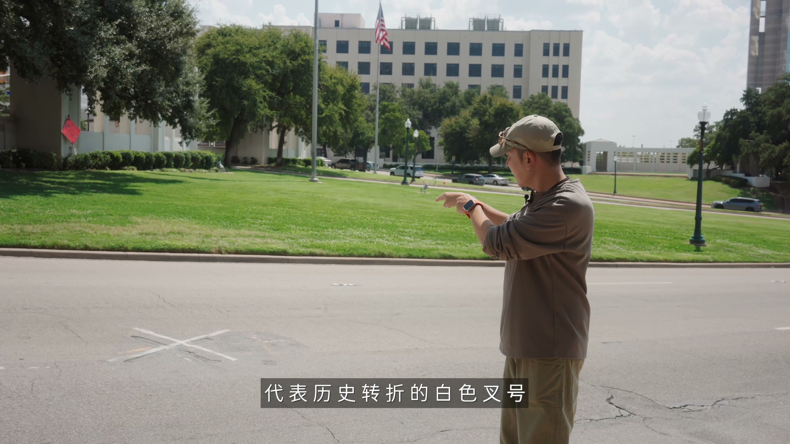

你一天民众 所有人都能这么轻易的买到枪 一天就会有这种 小概率的黑天鹅事件 如果解决问题的工具仍是暴力 黑天鹅就永远不会是最后一只 代表历史转折的白色X号 也会一次又一次的被画下 所以我不知道你怎么看 可以在弹幕里跟我们说出来 这样的文化也许从当年 阿塞移民踏上北美大陆的那一刻 宿命就早已注定

---

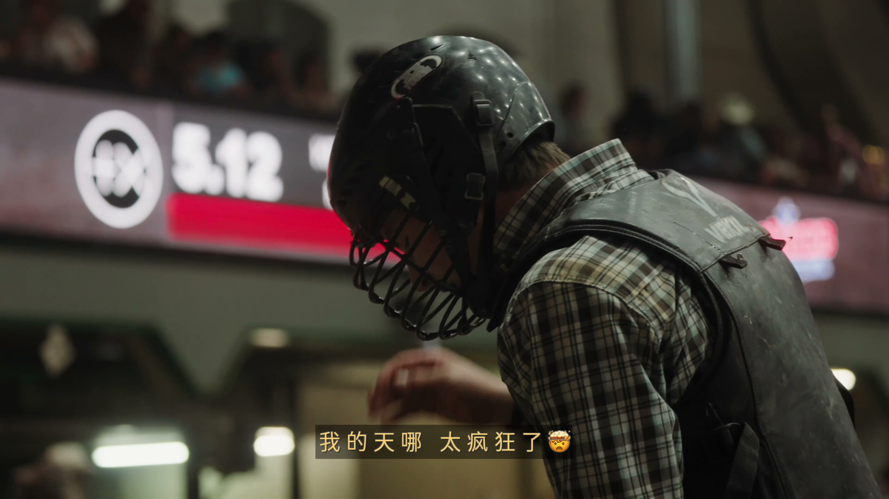

你现在就可以走到楼梯上 你就拍整个场的样子 天呐太疯狂了 十万人什么概念 十万人

---

人太多了 我从来没有在这么多人的地方待过 爱人地狱

---

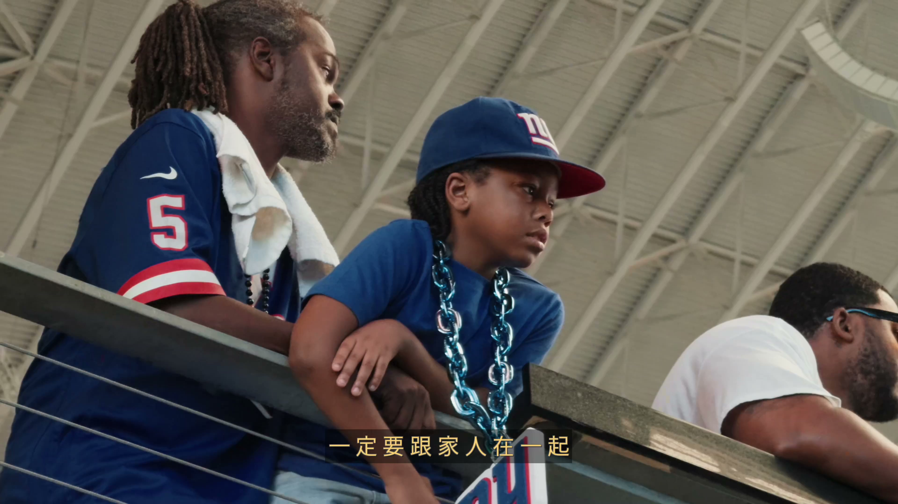

太震撼了 你们上完厕所 太好了 你们上完厕所 太好了 你们上完厕所 太好了 你们上完厕所 太好了 你们上完厕所 你们上完厕所 太好了 我们这些都是赛不跳的人 很多就比如说这场球 大家都会在家里看的 打篮球对美国来说太重要了 一定要跟家人在一起 然后享受放松 然后迎接下一个周的第一天来嘛 你喜欢打球吗 对啊 还有大型球员还是球员 球员肯定是 大型球员就去死吧 去死吧 大型球员就去死吧 我喜欢打球 聊着聊着给我买杯酒 这一句话顶了多少钱 顶了20多

---

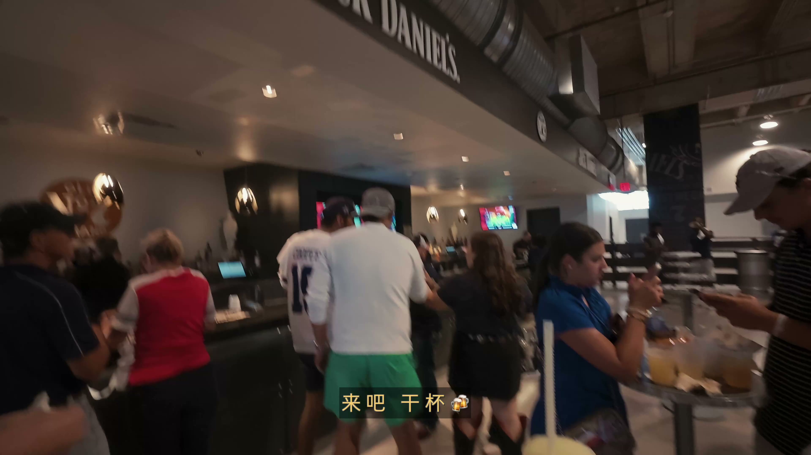

兄弟 谢谢 干杯 我们去打球吧

---

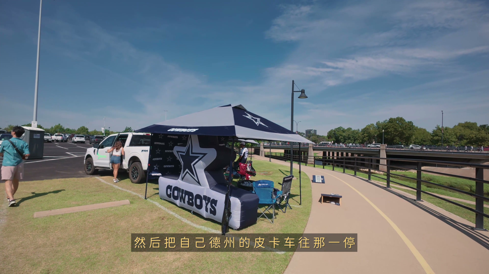

这就是一个典型的 非常典型的一个迷路 这是啥意思 就是把一家人也不进场 然后把自己德州的皮卡 然后这一停 然后喝酒 派对 再饭 再吃饭 这是免费的吗 对 免费的 这就是中国兄弟们 谢谢

---

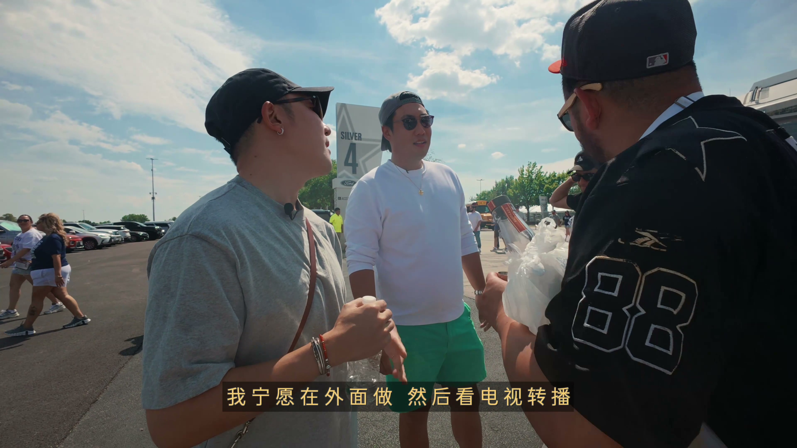

这叫什么 鱼气 好吃吗 超好吃 真的比里边200多块钱的 吃的好吃 多得多得多 牛肉 我准备了啤酒 我准备了水 我准备了酒 谢谢兄弟 我爱你们 我想让你们一起吃 我会 这是国家关系 你去吧 国家关系 进去 费了200多块钱 然后买食物和啤酒 我比较喜欢在外面 对 这很合理 去吧 兄弟 去吧 兄弟 达拉斯这个城市和福尔沃斯 这两个城市离得特别近 是完全保留了整个牛仔风格 还有城市规划的一个 特别原汁原味的一个地方 所以在这边的球队 都跟牛仔文化非常有关系 而想要弄明白他们的 枪支文化 牛仔文化 我们则必须要到沃斯堡的 牛仔小镇看看

---

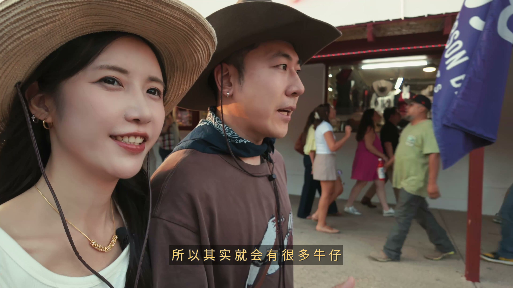

我们现在是在 城北非常有名的牛仔小镇 从达拉斯开车过来 半个小时就能到了 这个地方叫沃斯堡 然后这个小镇上 好多人都戴着牛仔帽 穿着大马靴子 他们这个姐妹城市 中国的是贵阳 哈哈 有点意思 牛仔的历史伴随着 正是美国的西境开拓史 西部时代的蛮荒与荣光 成为了日后牛仔文化的基调 但印象中柔杂的 镖刻赏金猎人 枪手和土匪的牛仔形象 更像是被美国西部文学 经过想象 重塑出来的浪漫化形象 事实上牛仔真正的工作 是放牧 巡边和赶牛 以前南北方这个畜牧业 差价太大 所以其实就会有很多牛仔 需要把大批的牲畜 从南部往北部赶 他们在赶的过程中 沃斯堡就是他们去出发前的 最后一个 相当于能最后喝点酒 然后赌点博的这么一个地方 赌点博 对 以前这个地方 赌博 我刚才以为你说 他们还要赌博士 赌个博 我说牛仔的文凭这么高吗 我在来之前 我没有想到这里是一个 这么阳光的城市 因为我脑子里面只有打牌 所以我以为他们是个很无聊 然后就是很拘谨的一个城市 你完全相反 这儿的天气像广州 又湿又热 对 巨热 但这儿的人像山东人 就是首先都能喝 民风淳朴 民风也飙汗

---

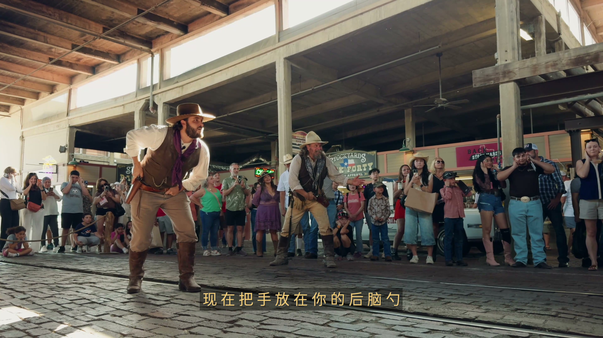

我以为他们是个很严肃的 还要去高地亚海 真是很严肃

---

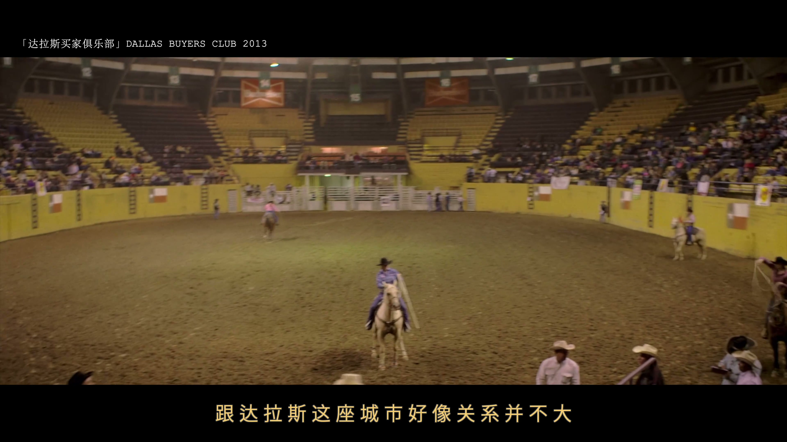

德州是整个美国最保守的州 它的保守体现在方方面面 我不知道我们现在来的这个城市 达拉斯 大家有没有想到一个 奥斯卡得奖的电影 达拉斯奶家俱乐部 大家整部片子看下去 你会发现这片子 跟达拉斯这座城市好像关键不大 最大一个原因就是 它里边涉及到了大量的 LGBT群体 艾滋病的一些元素 这些群体在德州 是绝对不能被接受的 因为德州是最保守的州 最信奉上帝的州 丧经理说了是亚当和夏娃 不是亚当和亚当 也不是夏娃和夏娃

---

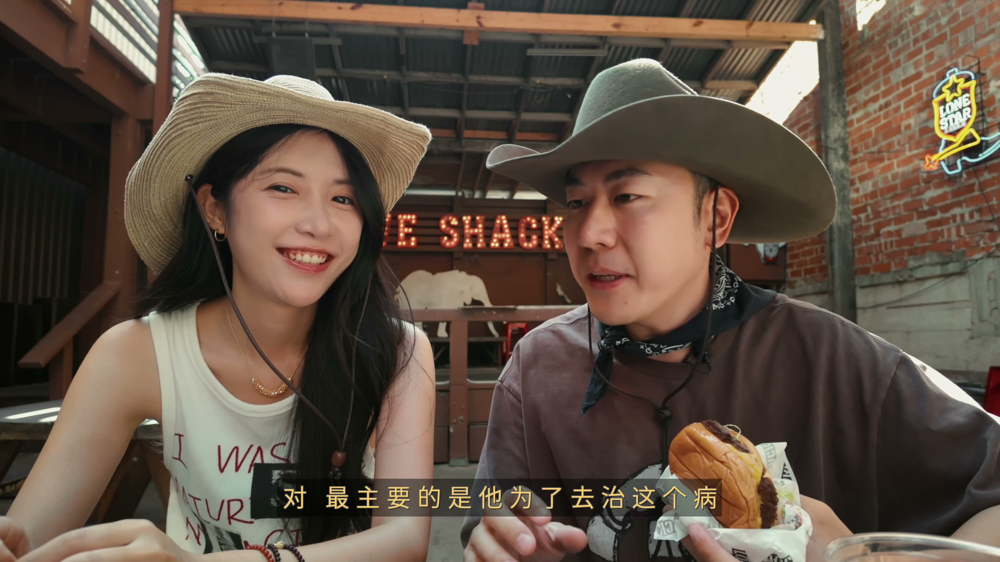

麦康娜主演这个角色 又是一个 又是一个牛仔 又是一个Cowboy 你别惹我民风飙汗 然后发现 她是血液传播的 所以她被误会她是Gay 对 最主要的是 她为了去治这个病 她认识了一个 就是LGBT群体 然后到刚开始说 你别碰我 说那个人 到最后 那个人死的时候 她好难受

---

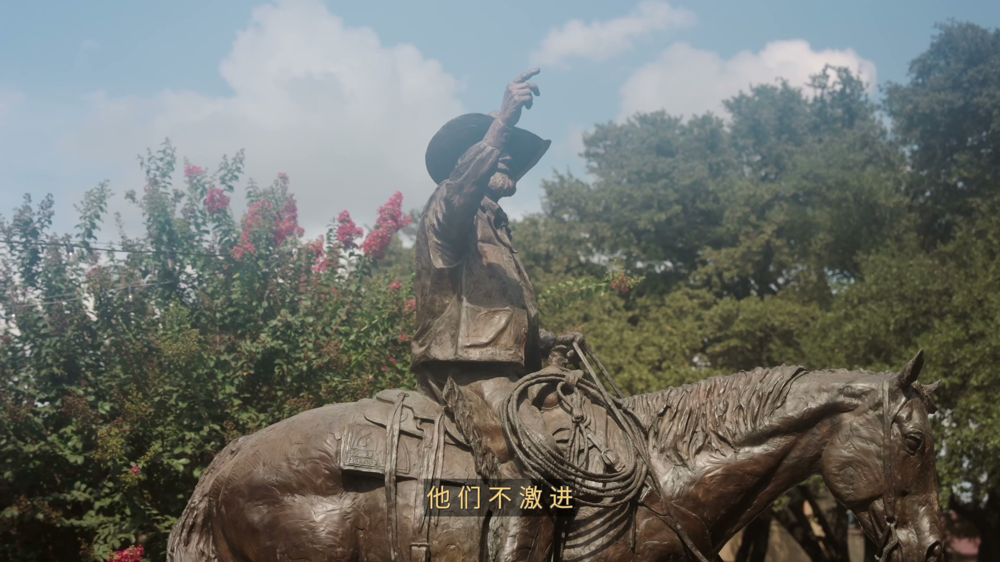

又来了 又共情了 爱哭鬼 她在得病前 最不能接受的群体 和解了且成为最好的朋友 但是加州恰恰相反 加州你看 我带你去的那个彩虹街 光子身子就在街上走 解释一下 为什么是达拉斯买家救助 如果是旧金山买家救助 这事不成立 完全相反的 就是说一个是共和党的大本营 一个是民主党的大本营 这就也就解释了达拉斯 或者说整个德州的 一个民风问题 保守 对吧 他们不激进 要稳定 对不对 因为整个德州的逻辑就是 低税收 低福利 我不知道大家看不看NBA 你们发现德州的球队都很强 森安托尼尔 马刺队 达拉斯小牛队 现在改名叫独星侠队 还有我的本命 火箭队 为什么大牌球星真的愿意来德州 因为他没有周税 是的 因为他没有 Money 对的 这啥呀 假牛

---

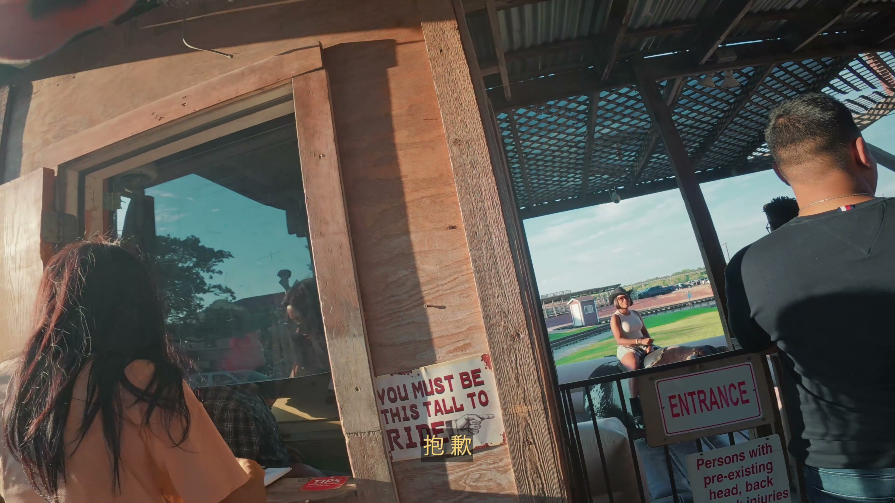

对不起

---

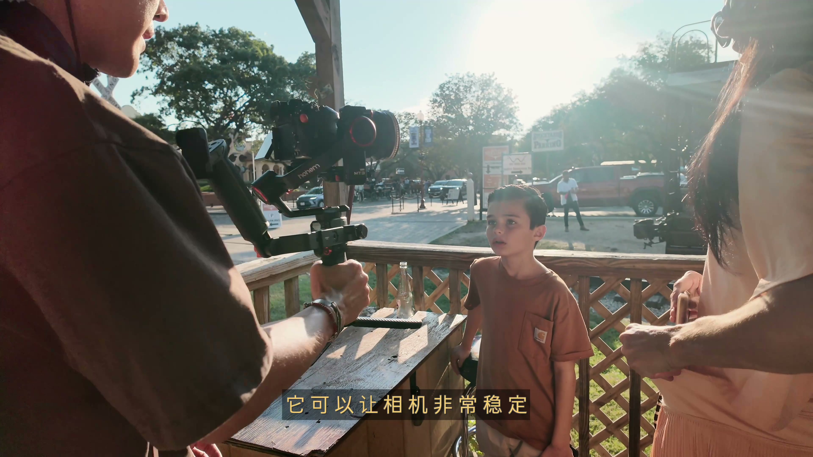

这个很稳定 所以让摄像机很稳定

---

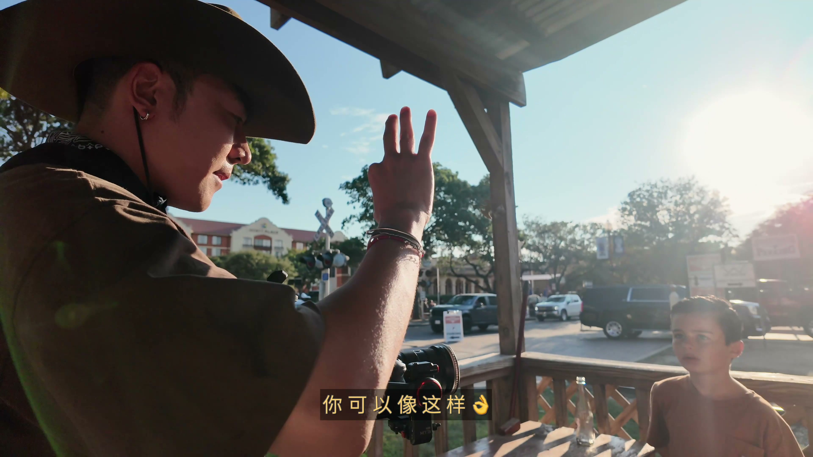

你可以这样 看得到吗 看得到

---

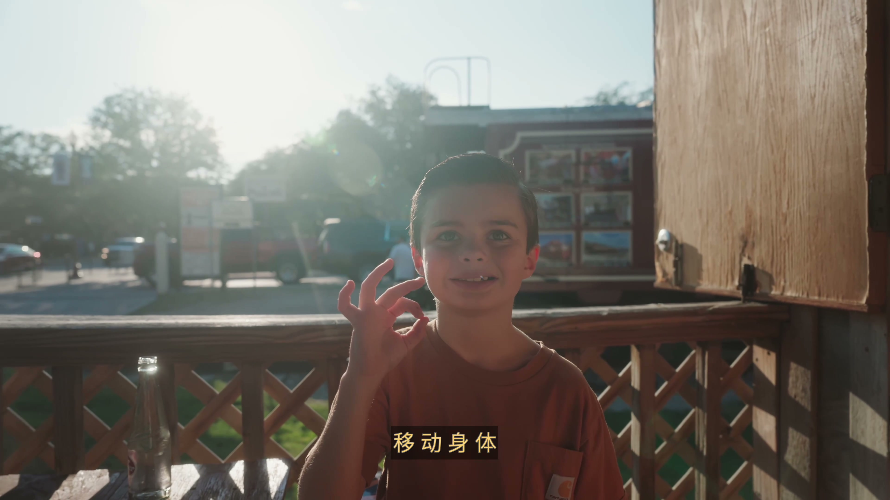

好 现在你可以动身体 没有 好 他在跟随你

---

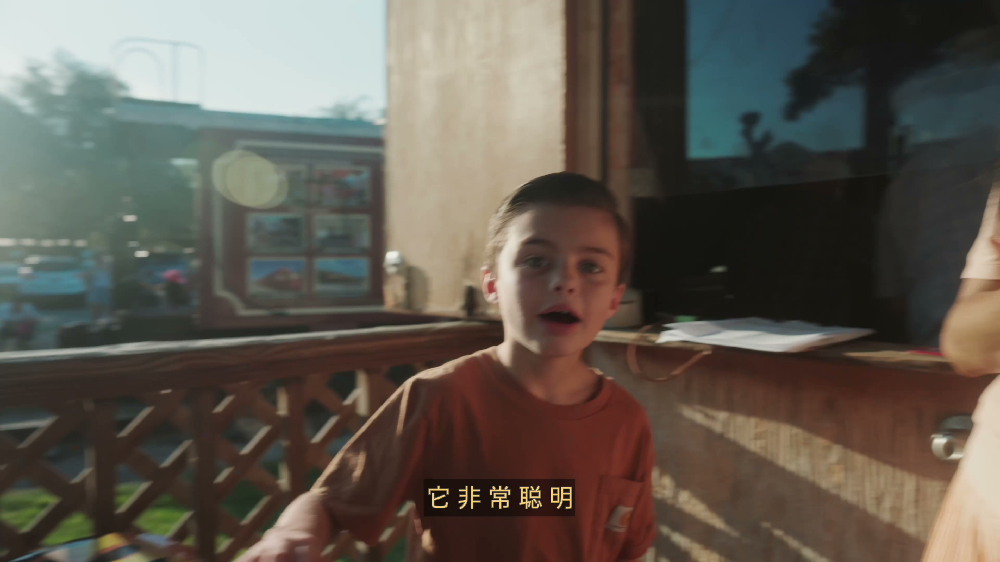

看 所以他真的聪明 是AI运作

---

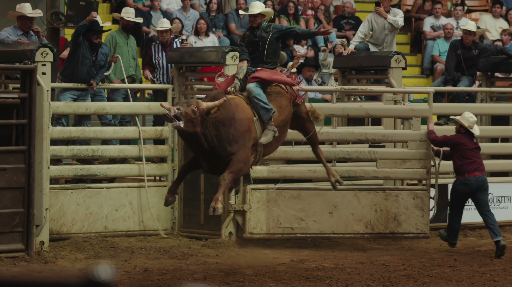

龙星

---

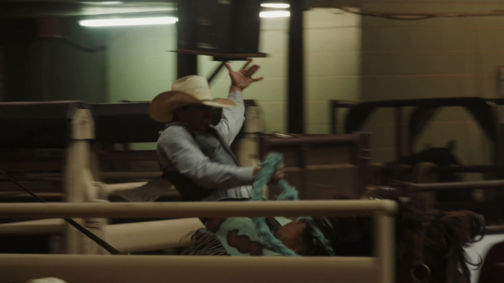

这次阿州牛多了 真的很厉害 刘乃鋒 加油

---

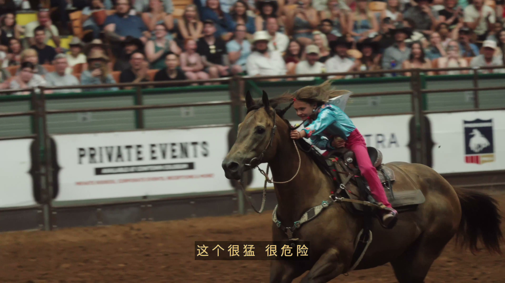

刘乃鋒 加油 这个很猛 很危险 现在错 错锯了 看

---

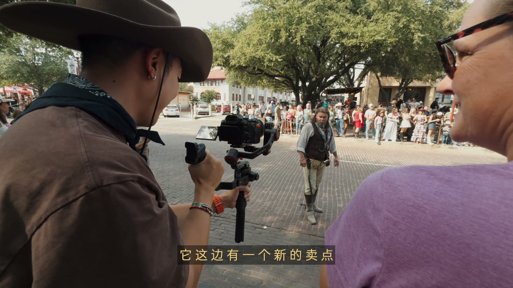

德州的保守 还体现在他们对于传统的坚持 例如每个周末 像这样骑牛套牛的赛事 也例如牛仔小镇 每天都会按时举行的赶牛游行 而主角就是这些长脚牛 有17只长脚牛在这边游行 然后我用这个浩瀚的明信 它这边有一个新的卖点 叫AI的万物皆可根 无论你是在高速公路上的一个牌子 还是说动物 还是任何的一个东西 在这个摄像头上 在这儿框选一个东西 然后这个文集就会自己去跟它 不需要接任何的线 而且这个小屏幕还可以单独的拿下来 作为一个小的监视器去使用

---

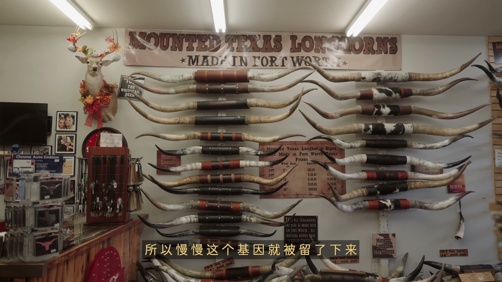

长脚牛就是西班牙的殖民者 带来了一种阿尔巴尼亚的牛 然后跟印度的一种牛去杂交 德州你看 它不是像内蒙 是那种一望无际的 这大草原来是好多那种带刺的 这个脚是为了扒开荆棘 吃草用的 所以慢慢这个基因就被留了下来 看 全都是 这些logo全都是长脚牛 全是 再加上你看 刚刚那边不是有铁路吗 通过铁路以后 就会有大量的类似于牲畜 被在这儿屠宰了以后 运往全国国地 对

---

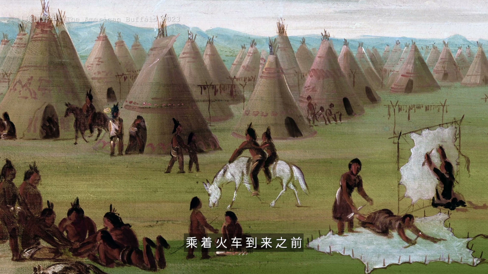

沃斯堡小站也是去往东部铁路的重要火车站 然而故事也在这里开始改变 随着铁路的盛行 赶牛的任务逐渐缩减 牛仔群体慢慢地成为了时代的边缘人 为了生存 他们把枪指向了这片大地原本的主人 还有野牛 看 而当你翻开孤独星球的美国特集 你会发现封面是一只看上去蓬松凌乱的野牛 事实上他们曾是北美最大的陆生动物 体重超过一吨 野牛的祖先像蒙马象一样 在冰河世纪通过了白岭海峡的冰桥登陆 此后在北美反映出数千万头的种群 在牛仔为首的开拓者乘着火车到来之前 印第安人与野牛在西部的广阔平原上和谐共生 但这条铁路就成了野牛的死亡专列 为了去探寻这个故事 我们决定继续驱车5个小时往西 去往他们在德州现存唯一的保护区 我们开了现在开了4个小时了一下 还有两个小时才能到 德州太大了 就是之前说呼伦贝尔有一个整个一个英国那么大吗 但你知道德州是三个英国那么大吗 你要说英国没概念 你要说呼伦贝尔那是挺大 除了俄罗斯以外 所有欧洲的国家都没有德州的面积大 就这一个州

---

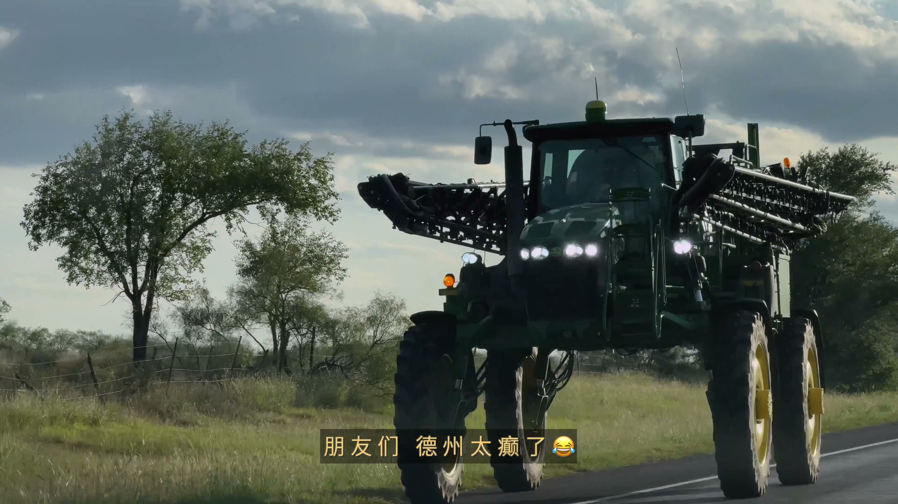

啥呀 朋友们德州太电了

---

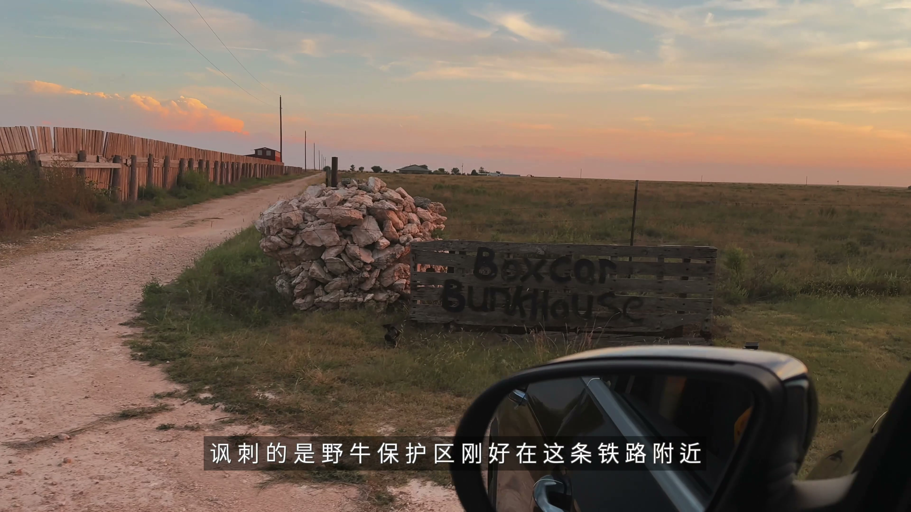

真正的房车 飞屋环游记 捧说的是野牛保护区刚好在这条铁路附近 所以我们当晚入住的民宿是这个样子的

---

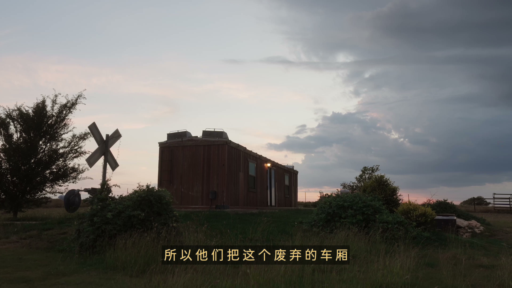

我们今天住的是一个废弃的火车车厢 然后这个RMB的主人 因为家里他的爸爸妈妈爷爷奶奶全都是铁路工人 所以他们把这个废弃的车厢就改造成了整个的民宿 浴缸 他给我们放好了水 这就是这个列车的门

---

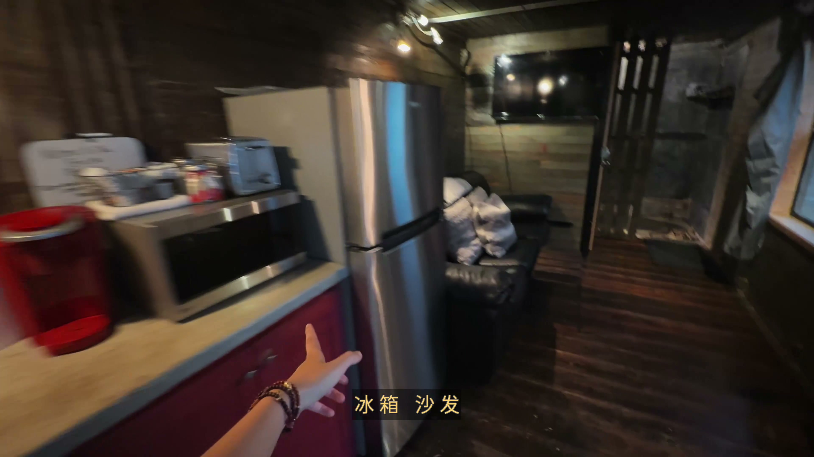

这边是床 然后这边冰箱 沙发 这是淋浴间 这淋浴间有点吓人

---

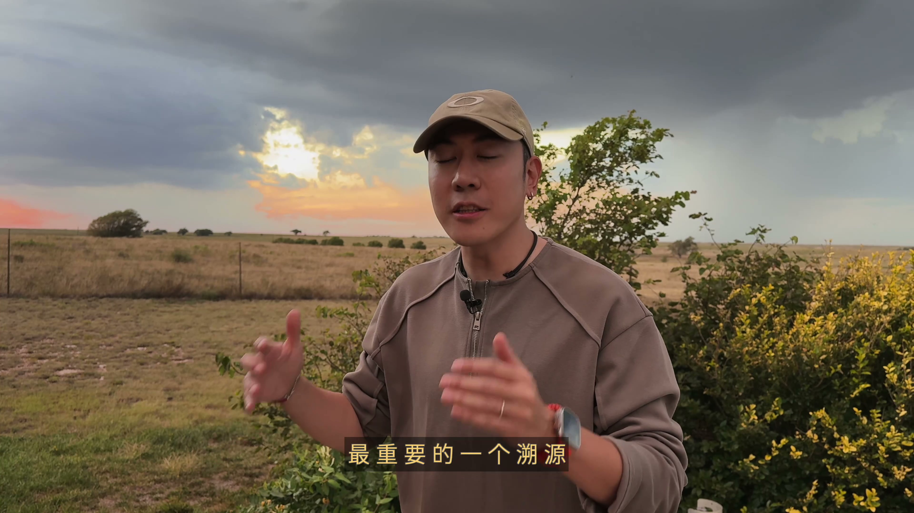

很特别的民宿 我们今天开了六个小时 今天住在这儿 明天就带你们去一个国家公园里面拍野牛 为什么要去拍野牛 因为这是牛仔文化最重要的一个宿院 所以如果要讲牛仔讲Cowboy讲达拉斯 你不来这的话 就像是目高枯枝于三维山一样 这就是达拉斯的三维山

---

为了能拍到北美野牛比较稳定的画面 我们这次准备了长焦 顺便给大家介绍一下 浩瀚MT3 Pro这个稳定器的承重 它的最大承重达到了2.5公斤 除此之外它还有一些其他的拓展配件 比如说这个补光灯 可以用多功能的滚轮去调整色温 还可以用根胶器来实现镜头的变焦 这样就可以拍摄稀稀可可的这种画面 同时拍摄这些天 我们也没有担心过它的续航 即便是拍摄一整天也毫无压力

---

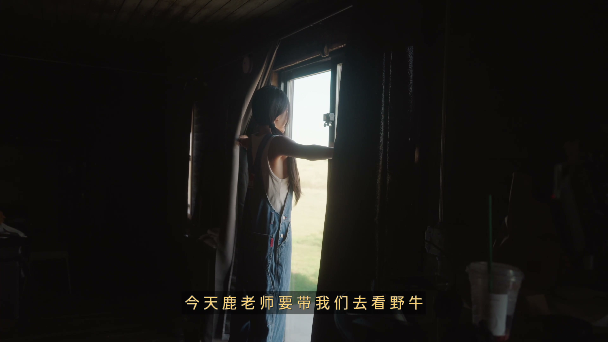

今天陆老师要带我们去看野牛 牛

---

祝大家牛气冲天 什么我在说什么

---

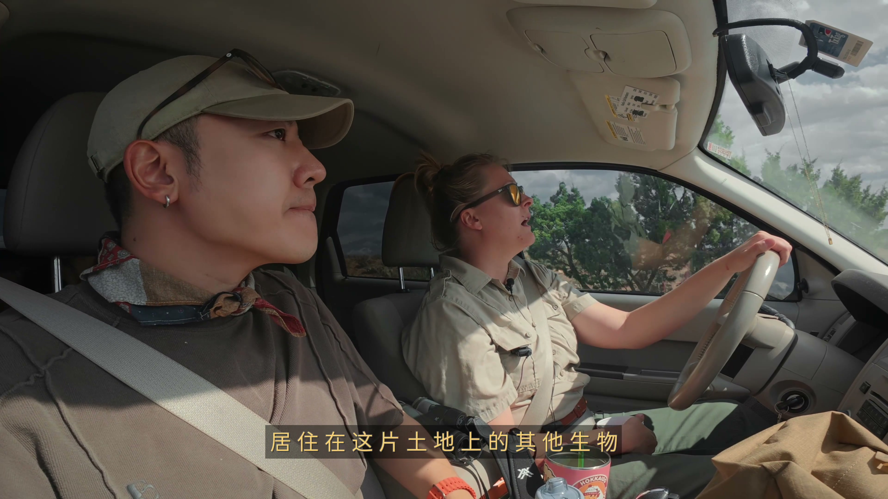

为了更深入的了解这个故事 我们提前预约了志愿者向导 纳塔莎 很高兴认识你 很高兴认识你 你好 我是陆 陆你好 她是我妻子 你好妻子 你怎么样 你很漂亮 你来自哪里 我们来自北京 你好 你好 我们走吧 我带你们去哪里没有人能去 没有人能去 所以我带你们去哪里特别的地方 因为那是我的 他们只是 那是白森的东西 是的 那是白森的东西 确实的 在所有地方 但我都看不到 是的 我没有 我确实没有想到这么大体格的野牛 竟然很难找到 但确实也有一些可爱的生物 跟他们同时分享这片土地 我们在卡普洛克有很多生物 我知道白森很酷 所以人们会来这里 因为他们想看到白森 但我们也有很多 其他在这片土地里的生物 你们可以看到小沙鸦 你们 这些叫做沙鸦 然后它们会咬 我们身后全部是 看见了吗 我们收好 它们非常警惕 因为它们是容易犯罪者 所以它们释放 它们把土地放在一天里 然后它们 在它们的村庄下居住 那是它们住的地方 它们有很多房间 白森狗 它们在一起的时候 它们会像吻似的 但其实它们在 在触摸牙齿 因为它们有牙齿的感觉 它们会帮助它们 它们会说话 它们会沟通 你饿吗 你饿吗 我不知道 你睡觉吗 哦 它们在吻 它们很社会 它们喜欢在一起 哦 看看 哦 它们 哦 哦 看看 它在吻它 它们喜欢 哦 来吧 吻我 哦 它们在吻

---

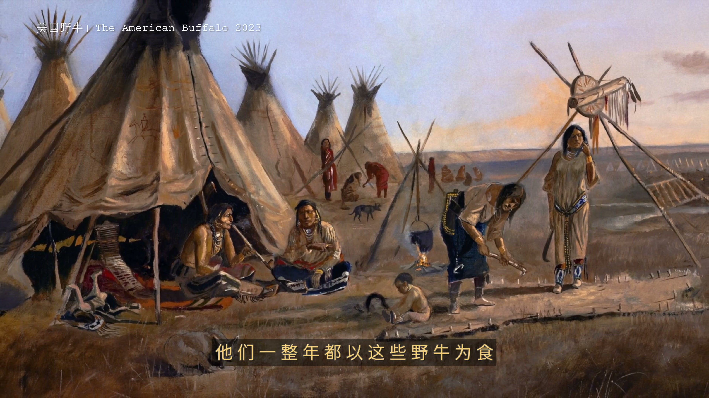

注意我 蜜糖 蜜糖 蜜糖在哪里 蜜糖 不不 是小蜜糖 这一部分 你看到这边有一个峰 在那里 佛洛杉尔文化 或者是培尔尔印地人 会 把蜜糖吐出岛 因为那是他们的死亡 因为他们 用了每一部分的蜜糖 它们会喝从蜜糖的外面 哦 它们用蜜糖的蝴蝶水 哦 它们会在那里 整年生活 那时候 那时候 很多人 在那时候杀了一伙人 没有伤害任何人 只要他们需要 有个科学家 印地安人取之有度 和野牛和谐共生了千年 南北战争结束后 随着杰弗逊的一指法令 无数新移民 奔往西部 淘金者 牛仔 与放牧人 尽情地攫取这片无主之地的财富 从此 印地安人与野牛的大平原时代 结束了

---

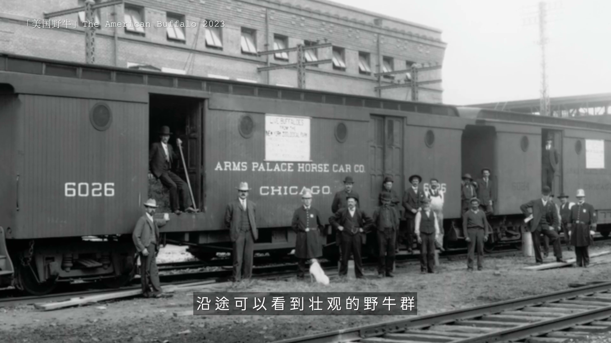

建造了红色的路线 但所有东西都被这些 大型的美麗的野牛 为了让这些工具 运作到我们的建筑 我们必须有一个链子 它们会在那里运行 这件东西是由野牛狩猪制造的 所以他们会去 并且冲击 百万的野牛 以获取牧草 这些叫做野狩狩 在19世纪 为了吸引东部居民乘坐火车 去西部探险和定居 铁路游会公司会宣传 沿途可以看到壮观的野牛群 在这种旅行项目 而短短十几年间 壮观的野牛大迁徙再不可见 以观光野牛为名修建的铁路 成为了大规模猎杀野牛 并将其毛发和骨肉运往东部的工具 而曾经自由游牧在密西西比沿岸 与广茂西部草原的印第安人 也在瘟疫 战争和饥荒中 不断的被压缩生存领地 直至被迫迁入 远离所谓文明的保留地

---

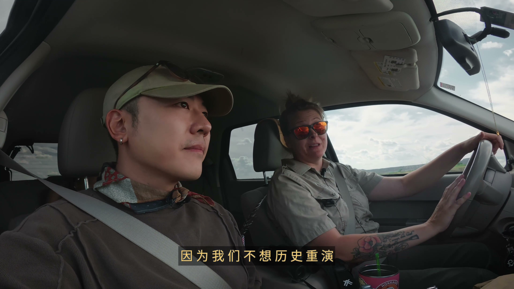

还有隐藏 探索 杀害 杀活 卫生 因为他们想要购买 因为他们想要枪 他们想要骑马 这件事很严重 是很严重的事 但我们必须告诉它 因为我们不想它违离 对 你知道吗 我们不能忘记这里的历史 因为 越是你忘记 越是你再次担心它会发生 我们不想这样 对

---

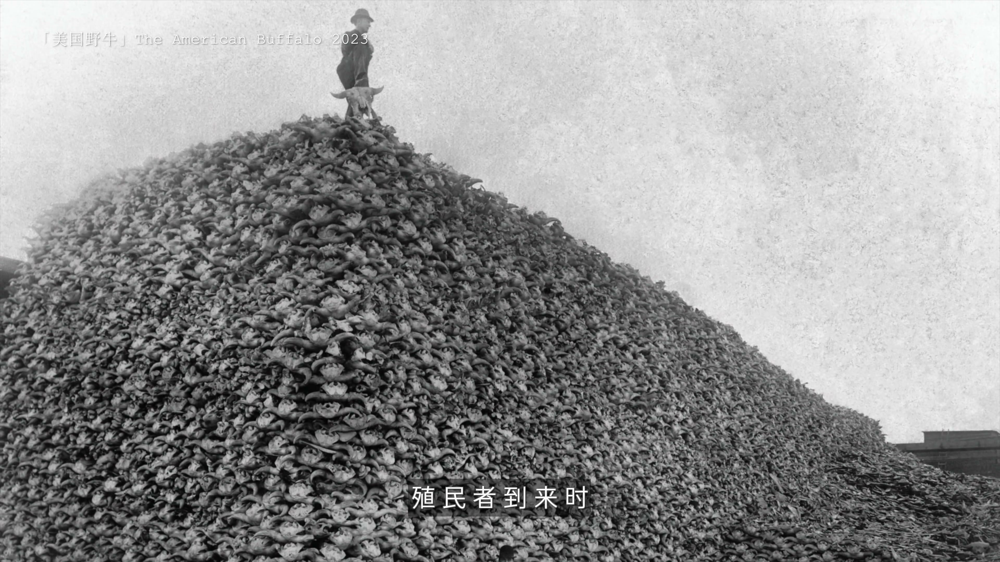

当我们现在回忆这段往事 殖民者到来时 到底谁才是野蛮 谁才是文明呢

---

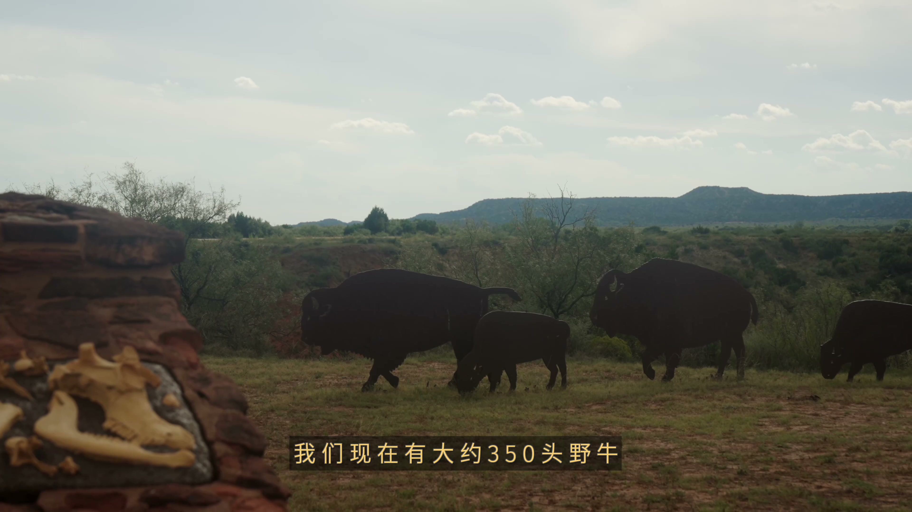

当然在这个故事里 还有大量悲惨的华人劳工 参与了铁路的建设 但那是另外一个蛊蛇 我们回头再聊 现在美国的情况如何 我们从1996年到2012年 我们增长了36百亿的细菌 我们现在有三百三百多个 这是古代的大蛇 我认为是比较大的蛇 还有蛇脑 哦 对 很大 跟猫大蛇一样 好的

---

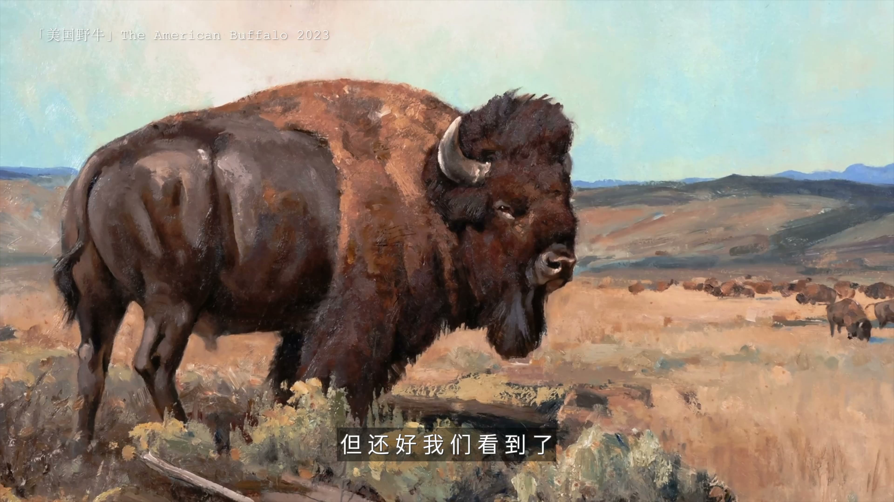

因为丧失了DNA的多样性 野牛的体型越来越小 但还好我们看到了 野牛种群的保育和复苏 而北美驴哥就没有这么幸运了

---

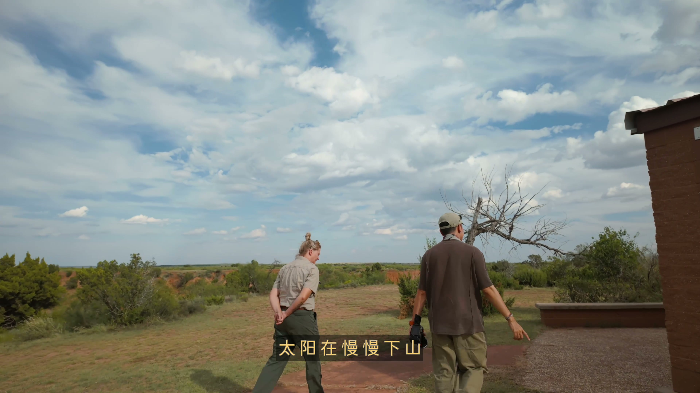

他们在这里 他们在哪里 他们在哪里 你们有看到野蛇吗 没有 没有 没有 还没 所有人都没看到 山下来 会很冷 你们可能能听到它们 如果它们靠近 它们会像 呃呃呃 真的吗 是的 它们很大声吗 猫大蛇非常大声 是的 它们非常大声

---

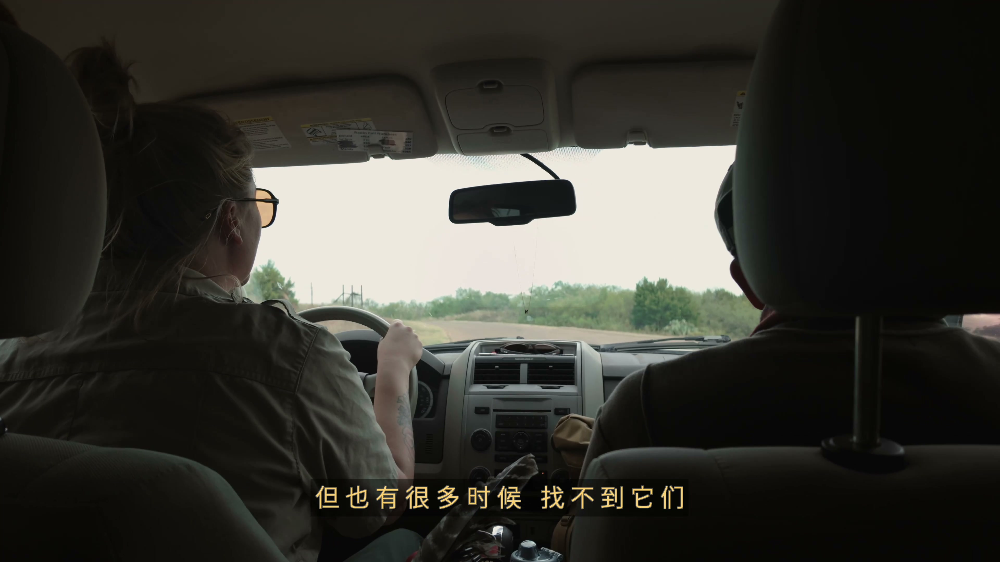

我们回去了 今天结束了 没看到 早上我兴致 勃勃地照大家 带大家流气冲天 天气真好 你现在在哪里 这是他们当兴趣兴趣的人的唯一坏事 你永远不知道他们在哪里 没关系的 我已经知道很多事情 他们的事情 所以 是的 真的很好 很多时候 我都会说 请你离开我的路 我正在想离开 很多时候 他们 你们在哪里 你们在哪里 他们在 当天气这样 他们就像消失了 是的 不在那里 没有一样 你今天晚上回到大陆 今天晚上 是的 我们在这里四个小时 五个小时的旅行 我的天 因为特斯拉是很大 它是阿拉斯加最大的国家 我知道 是的 它是全美洲三次 我看到一些蜜蜂 真的吗 是的 我看到一些蜜蜂

---

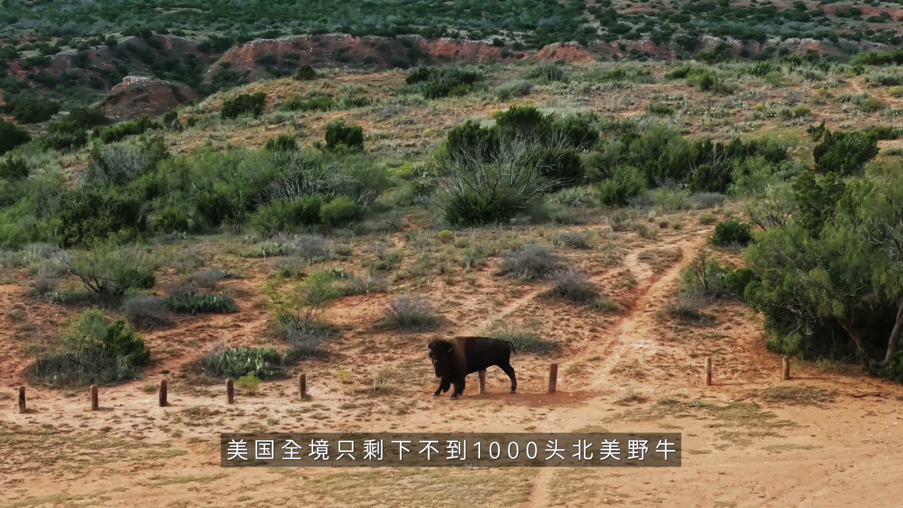

我快要哭了 是的 我们开始了 快要结束的时候 我看到了它们 1882年 黄石公园的野牛 仅上23头 而到1890年 美国全境只剩下 不到1000头北美野牛 而从遍布全美的野牛 在以下的35个州 宣告灭绝 因为我们所在的 Good night的私人保护群 德克萨斯州 性免上榜 那儿

---

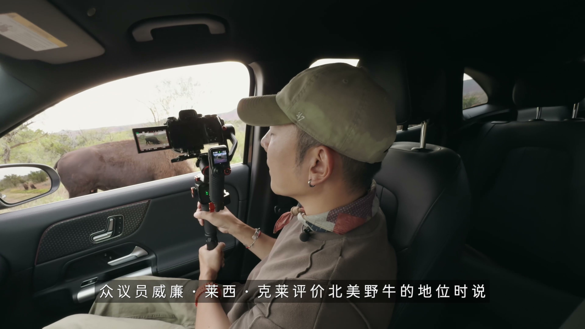

1905年 罗斯福颁布法令 第一次将野牛列为 珍稀的保护动物 2016年 奥巴马签署了法案 北美野牛 正式成为了美国国寿 众员威廉·莱西克来 评价北美野牛的地位是说 没有其他任何的本土物种 比这种高贵的动物 更能讲述美国的故事了 如今 野牛的种群得以延续 目前不会再有灭绝的风险

---

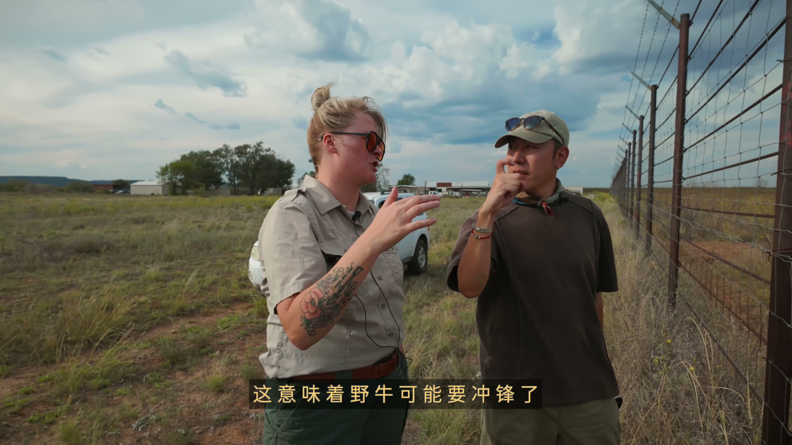

所以你们可以知道 野牛的感觉 根据牠的尾巴 牠的尾巴正在高架 但牠正在上厕所 好吗 而且它们都在高架 一只动物的尾巴 就是一只开心的尾巴 好 所以它们下降了 现在牠开心了 牠们开心了 牠们下降了 就像狗一样 如果它们 在一个完全的问号中 还在 那就是说 那群群应该要在充电了 好 所以如果你把手伸出来 你把一只眼睛关上 如果你把群群完全盖起来 你安全了 好 如果不是 如果你看到群群在盖起来 你太近了 如果那群群 决定要来找你 嗯 如果不是那群群 他们可以跑很快 你不会在时间内 回到你的车上

---

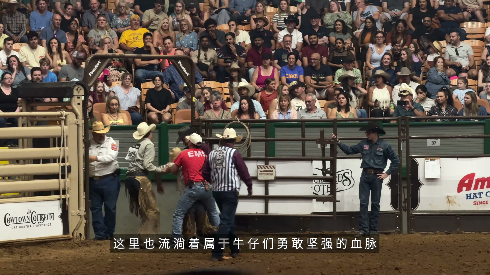

尼采说 这个世界上没有真相 只有视角 每个文明的族群 都有自己复杂的过往和历史 开拓者还是入侵者 文明还是野蛮 他们各有答案 历史是由胜利者书写的 但真相只有亲历者才知道 当然我也不否认 这里也流淌着 属于牛仔的勇敢坚强的血脉 但力量的背后 如何把握尺度 则取决于文明本身 选择什么成为自己信仰的 基石与支点 正如这台浩瀚稳定器 用精准的力量控制 消解了无序混乱的抖动 让我们能在精心动魄的 德州大冒险中 从容稳定的去感受和记录

---

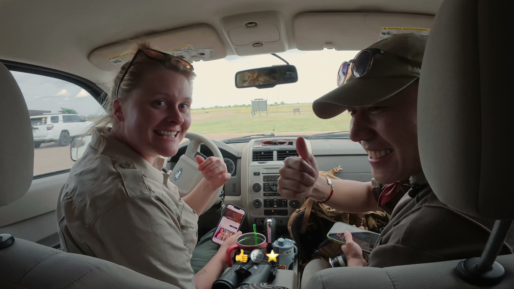

当然如果你喜欢我们的 美国系列 记得关注我们 1730 对 对 改叉它

---

其实这次拍摄 本来还想带着工作室的 小伙伴来帮忙 但因为签证迟迟被卡下发 所以这一次旅行 还是只有我和米奥士两个人 好在有这台浩瀚的MT3 Pro 能够给我们提供一个 稳定的支点 无论是单兵作战 还是辅助侧拍 都能让我们安心的 拥有观看世界的不同视角 点赞过5万 我会迅速的更下一期 我们下期再见

---
